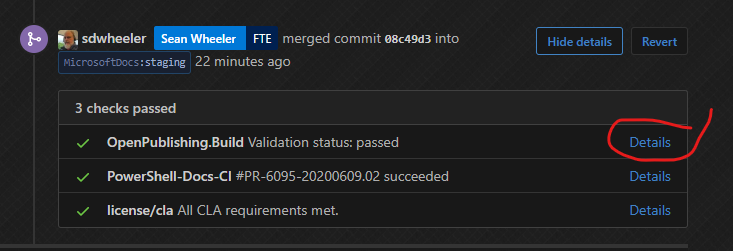

# Feature Request - CabGen Explorer changes

## Current issues

CabGen explorer shows me the results of the CI job

- The report shows what was built but not every file is built every time
- I would rather have a simple status (pass/fail) for the CI run instance
- I am more interested in seeing the contents of the blob store
- The webpage will not scale in production

The page contains all files from every run.

- For PowerShell, that is at least 130 files per build.
- With daily builds, this get REAL big, REAL fast. With more partners using the CI, this gets
  exponential.
- I am only interested in seeing MY results.

The page should require authentication.

- We don't need customers looking under the covers.
- Authentication could help filter views by user.

CabGen Explorer may not be the right solution for this.

## Requested changes

### Build notifications and logging

As a content owner:

- I need to be notified that the CabGen portion of the build has completed and receive an simple
  status (pass/fail).
- So that I am satisfied that the new updateable help is now available to the public.
- In the failure case, I need access to the detailed build report so that I can troubleshoot the
  problem and fix content if needed.

Suggested user experience:

- Have CabGen work as a PR Check step where status is updated in the PR comments and the build step
  must pass for the PR to be merged.
- Link the CabGen build log to the PR comment just like OPS does (see screenshot for example)

  

### Filtered view of the current state of the blobstore

As a content owner:

- I need a way to see the current contents of the cabinets blobstore
- So that I can troubleshoot post-publishing issues with Update-Help
  - Common problems caused by content metadata errors
    - The filenames built by CabGen do not work with Update-Help
    - The HelpInfoURI points to the wrong endpoint

Suggested user experience:

- Provide a way to browse the blobstore that can be filtered by path (moniker) or module name
- This should not be a view of the build log but a live view of the blobstore
- Simplest solution would be to allow owners to use Azure Storage Explorer but permissions may be
  difficult to manage.
