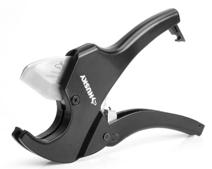
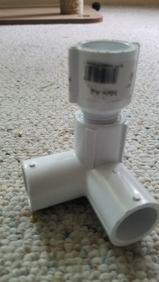
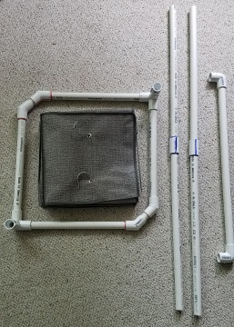
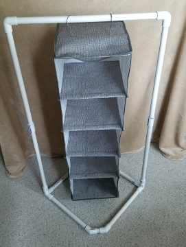

# Camp clothes rack

I built this rack to take to the 24th World Scout Jamboree at the Summit Bechtel Reserve. It uses
12-feet of 1/2-inch PVC pipe. I bought two 10-foot lengths, so I had 8-feet left over. Home
Depot sells a 2-foot length for $1.31. Not much savings over buying a 10-foot section.

## Cost & Tools

|Item|Qty@Price| Cost|
|--|:--:|--:|
|Closet Organizer (Fred Meyer)|| $9.99|
|1/2"x10' PVC Sched 40 pipe|2@$2.20| $4.40|
|1/2" PVC 3-way side outlet|2@$1.56| $3.12|
|1/2" PVC male adapter|2@$0.46| $0.92|
|1/2" PVC 45 degree elbow|4@$0.76| $3.04|
|1/2" PVC coupling|2@$0.46| $0.92|
|1/2" PVC 90 degree elbow|2@$0.39| $0.78|
|Subtotal|| $23.17|
|Tax (10%)|| $2.32|
|Total|| $25.49|

Tools (I owned these already)

- Tape measure
- Sharpie markers (2 or 3 colors)
- [Husky 1-1/4 in. Ratcheting PVC Cutter](https://www.homedepot.com/p/Husky-1-1-4-in-Ratcheting-PVC-Cutter-16PL0101-1/304217581)

  

## Assembly

1. Cut the PVC pipe according to the cut list.

   |Cut List|Qty|Length(in.)|
   |--|:--:|--:|
   |12" pipe|4|48|
   |18" pipe|4|72|
   |2" pipe|2|4|
   |20" pipe|1|20|
   |Total(in.)||144|

1. Assemble the base corner pieces.

   

1. Assemble the base using the four 12-inch tubes with 45-degree elbows. The elbows are joined by a
   2-inch tube.

1. Assemble the uprights by joining two 18-inch tubes using the couplers.

   

1. Insert the uprights into the corners of the base

1. Join the uprights using the 20-inch tube and two 90-degree elbows.

   

   Center the hanging organizer for stability. There is room to hang other clothes on either side.

### Notes

- I highly recommend purchasing the PVC tube cutters if you don't have them. The cuts are super
  clean and easy.
- At Home Depot, the 3-way side-outlet connectors came with one threaded coupling and two slip-fit
  couplings. So I had to buy the threaded adapter to go on top.
- I chose to use couplers and two 18-inch tubes for the uprights. This is more rigid than using
  single 36-inch tubes. And it breaks down smaller to pack in my duffle bag.
- I used colored markers to mark the ends of the tubes and the couplers they fit into. This makes it
  easier to reassemble later.
- I bought the closet organizer at Fred Meyer (similar to Target). It is 10-inches square and
  36-inches tall (when hanging).

## Packing

The whole kit weighs 3lbs-6oz. I used bungie cords to wrap the poles and organize the couplers.

