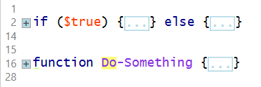
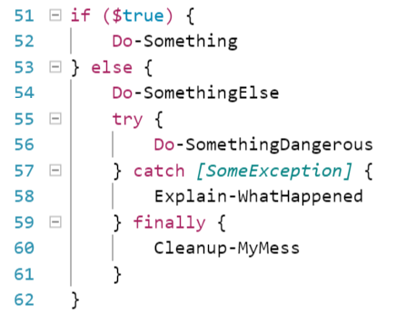

# PowerShell Style Guide

## Terminology

| Term | Definition |
|---|---|
| braces | The `{` and `}` characters |
| brackets | The `[` and `]` characters |
| parentheses | the `(` and `)` characters |
| backtick | the '`' character ASCII 0x60 aka grave accent |
| single quote | the `'` character ASCII 0x27 aka tick |
| double quore | the `"` character ASCII 0x22 |

## Code Layout & Formatting

Please note that many of these guidelines, in particular, are purely about readability. Some of
them are arbitrary rules, but they are based on decades of traditions in programming, so while you
may disagree with some rules (and should always follow the rules of individual projects), when we
ask you to leave an empty line after a closing function brace, or two lines before functions, we're
not being capricious, we're doing so because it makes it easier for experienced developers to scan
your code.

### Maintain consistency in layout

Rules about indentation and line length are about consistency across code bases. Long practice has
shown that it's easier to read and understand code when it looks familiar and you're not being
distracted by details. To create that familiarity, it's better for everyone to follow a single set
of rules.

If you do have a legacy project that is in source control and you decide to reformat code to adopt
these rules, try to make all of your whitespace changes in a single a commit that does _nothing_
but edit the whitespace. You should never reformat the whitespace on a file as _part_ of a content
change.

### Always use CmdletBinding

Let's just get this out of the way: all of your scripts should start life as something like this
snippet:

```powershell
[CmdletBinding()]param()
process{}
end{}
```

You can always ignore one of the blocks, and add `begin`, add parameters and so on, but you should
never write a script without CmdletBinding, and you should never write one without at least
_considering_ making it take pipeline input.

### Use of braces

Consider the following examples.

```powershell
if ($true) {
    Do-Something
} else {
    Do-SomethingElse
    try {
        Do-SomethingDangerous
    } catch [SomeException] {
        Explain-WhatHappened
    } finally {
        Cleanup-MyMess
    }
}
```

#### Open braces on the same line

Placing the opening brace on the same line looks nicer in editors that support code folding (E.g.
PowerShell ISE). It also scans better. The trailing open brace is a cue that there is more code to
follow and that the current line is not a standalone statement.

Code-folding in PowerShell ISE



Avoid blank lines after the opening brace and before the closing brace unless it improves the
readability of a large internal block of code.

#### Indent closing braces to match the opening line

Many editors will show indentation bars to help you line up you braces. This improves the
scanability of your code.

Indentation bars in VSCode



#### Final closing braces should always be on their own line

This is a clear signal to the reader that they have come to the end of a block of code. This is
especially helpful for long or deeply indented code blocks.

In the example of if/else and try/catch/finally blocks, it is preferred to put the secondary keywords (else, catch, etc.) on the same line with the previous closing brace. This is sometimes referred to as "cuddling" the keyword. There are cases where this may not best format for readability. In those cases it is acceptable to put the catch on a new line. For example:

```powershell
try {
    Do-SomethingDangerous
}
catch [SomeException] {
    Explain-WhatHappened
}
catch [SomeOtherException] {
    Explain-WhatHappened
}
finally {
    Cleanup-MyMess
}
```

Be careful not to add blank lines after the closing brace. PowerShell sees the blank line as a
statement terminator. This will truncate your code block and could cause errors and unexpected
results. The following example will not run properly.

```powershell
# Don't do this!!!
try {
    Do-SomethingDangerous
}

# catch/finally will fail
catch [SomeException] {
    Explain-WhatHappened
}

finally {
    Cleanup-MyMess
}
```

## Indentation, spaces, and line continuation

### Use spaces not Tab characters

Different editors display tabs differently. For consistency, use only spaces. Most editors can be
configured to insert a set number of spaces when you hit the Tab key on the keyboard. Configure
your editor to insert four spaces when the Tab key is used. This will ensure that your code will
alway be aligned, no matter which editing environment is used.

### Use four *spaces* per indentation level

This is what PowerShell ISE does and understands, and it's the default for most code editors.

The 4-space rule is optional for continuation lines. Hanging indents (when indenting a wrapped
command which was too long) may be indented more than one indentation level, or may even be
indented an odd number of spaces to line up with a method call or parameter block.

```powershell
# This is ok
$MyObj.GetData($Param1,
               $Param2,
               $Param3,
               $Param4)

# This is better
$MyObj.GetData(
    $Param1,
    $Param2,
    $Param3,
    $Param4
)
```

### Blank lines

When writing a PowerShell code to be saved as a script file, surround function and class
definitions with two blank lines.

**WARNING: Do not use multiple blank lines within a code fence in a Markdown document.** The
additional blank line terminate the code block processing in the Markdown rendering engine. Only
use a single blank line between sections of code.

Method definitions within a class are surrounded by a single blank line.

Blank lines may be omitted between a bunch of related one-liners (e.g. empty functions)

Additional blank lines may be used sparingly to separate groups of related functions, or within
functions to indicate logical sections (e.g. before a block comment).

End each file with a single blank line.

#### Maximum Line Length

Limit lines to 115 characters when possible.

The PowerShell console is, by default, 120 characters wide, but it allows only 119 characters on
output lines, and when entering multi-line text, PowerShell uses a line continuation prompt: `>>> `
and thus limits your line length to 116 anyway.

Most of us work on widescreen monitors these days, and there is little reason to keep a narrow line
width, however, keeping files relatively narrow allows for side-by-side editing.

### Line continuation

Do not use the backtick character for line continuation unless there is no other option.

Whenever possible, use PowerShell implied line continuation inside parentheses, brackets, and
braces. When passing multiple parameters with long names and values, the preferred way to avoid long
lines is to use splatting (see
[About_Splatting](https://technet.microsoft.com/library/jj672955.aspx)). These should always
be used in preference to the backtick for line continuation when applicable, even for strings:

```powershell
Write-Host (
  "This is an incredibly important, and extremely long message. " +
  "We cannot afford to leave any part of it out, nor do we want line-breaks in the output. " +
  "Using string concatenation let's us use short lines here, and still get a long line in the output"
)
```

#### Trailing spaces

Lines should not have trailing whitespace. Extra spaces result in future edits where the only
change is a space being added or removed, making the analysis of the changes more difficult for no
reason. This is a common cause of problem with you use the backtick for line continuation.

#### Spaces around parameters and operators

You should use a single space around parameter names and operators, including comparison operators
and math and assignment operators, even when the spaces are not necessary for PowerShell to
correctly parse the code. One notable exception is when using colons to pass values to switch
parameters. In this case, the colon is acting as a space for readability.

```powershell
# Do not write:
$variable=Get-Content $FilePath -Wait:($ReadCount-gt0) -First($ReadCount*5)

# Instead write:
$variable = Get-Content -Path $FilePath -Wait:($ReadCount -gt 0) -First ($ReadCount * 5)
```

### Spaces around special characters

White-space is (mostly) irrelevant to PowerShell, but its proper use is the key to writing easily
readable code.

Use a single space after commas and semicolons, and around pairs of curly braces.

Avoid extra spaces inside parenthesis or square braces.

Nested expressions `$( ... )` and script blocks `{ ... }` should have a single space _inside_ them
to make code stand out and be more readable.

Nested expressions `$(...)` and variable delimiters `${...}` **inside strings** do not need spaces
_outside_, since that would become a part of the string.

### Avoid using semicolons (`;`) at the end of each line

PowerShell will not complain about extra semicolons, but they are unnecessary, and get in the way
when code is being edited or copy-pasted. They also result in extra do-nothing edits in source
control when someone finally decides to delete them.

They are also unnecessary when declaring hashtables if you are already putting each element on it's
own line:

```powershell
# This is the preferred way to declare a hashtable if it must go past one line:
$Options = @{
    Margin = 2
    Padding = 2
    FontSize = 24
}
```

## Letter casing rules

|Identifier|Camel|Lower|Pascal|Upper|Examples and notes|
|---|:---:|:---:|:---:|:---:|---|
|Language keyword||&check;|||`try`, `catch`, `foreach`, `switch`<BR>No language other than VB uses mixed-case keywords|
|Process block keyword||&check;|||`begin`, `process`, `end`, `dynamicparameter`<BR>As above|
|Comment help keyword||||&check;|`.SYNOPSIS`, `.EXAMPLE`<BR>Readability|
|Constant|||&check;||`$PascalCase`|
|Exception|||&check;||`PascalCase`|
|Function|||&check;||`PascalCase`|
|Function or method argument|||&check;||`PascalCase`|
|Global variable|||&check;||`$PascalCase`|
|Local variable|&check;||||`$camelCase`, `$args`, `$this`|
|Package or module|||&check;||`PascalCase`|
|Class|||&check;||`PascalCase`|

### Cmdlet and parameter usage

While PowerShell is not case sensitive, you should use the proper casing for all cmdlets and
parameters. Use IntelliSense tab-completion to ensure that the letter-casing of cmdlet names and
parameters match their definitions. Never use aliases for cmdlets or parameters. This improves
readability of your code and avoids ambiguity.

## Comments

Comments that contradict the code are worse than no comments. Always make a priority of keeping the
comments up-to-date when the code changes!

Comments should be in English, and should be complete sentences. If the comment is short, the
period at the end can be omitted.

Remember that comments should serve to your reasoning and decision-making, not attempt to explain
what a command does. With the exception of regular expressions, well-written PowerShell can be
pretty self-explanatory.

```powershell
# Do not write:
# Increment Margin by 2
$Margin = $Margin + 2

# Maybe write:
# The rendering box obscures a couple of pixels.
$Margin = $Margin + 2
```

### Block comments

Don't go overboard with comments. Unless your code is particularly obscure, don't precede each line
with a comment -- doing so breaks up the code and makes it harder to read. Instead, write a single
block comment.

Block comments generally apply to some or all of the code which follows them, and are indented to
the same level as that code. Each line should start with a # and a single space.

If the block is particularly long (as in the case of documentation text) it is recommended to use
the `<# ... #>` block comment syntax, but you should place the comment characters on their own
lines, and indent the comment:

```powershell
  # Requiring a space makes things legible and prevents confusion.
  # Writing comments one-per line makes them stand out more in the console.

  <#
      .SYNOPSIS
        Really long comment blocks are tedious to keep commented in single-line mode
      .DESCRIPTION
        Particularly when the comment must be frequently edited,
        as with the help and documentation for a function or script
  #>
```

### Inline comments

Comments on the same line as a statement can be distracting, but when they don't state the obvious,
and particularly when you have several short lines of code which need explaining, they can be
useful.

They should be separated from the code statement by at least two spaces, and ideally, they should
line up with any other inline comments in the same block of code.

```powershell
$Options = @{
    Margin = 2          # The rendering box obscures a couple of pixels.
    Padding = 2         # We need space between the border and the text
    FontSize = 24       # Keep this above 16 so it's readable in presentations
}
```

### Function documentation comments

Comment-based help should be written in simple language.

You're not writing a thesis for your college Technical Writing class - you're writing something
that describes how a function works. Avoid unnecessarily large words, and keep your explanations
short. You're not trying to impress anyone, and the only people who will ever read this are just
trying to figure out how to use the function.

If you're writing in what is, for you, a foreign language, simpler words and simpler sentence
structures are better, and more likely to make sense to a native reader.

Be complete, but be concise.

#### Location

In order to ensure that the documentation stays with the function, documentation comments should be
placed INSIDE the function, rather than above. To make it harder to forget to update them when
changing a function, you should keep them at the top of the function, rather than at the bottom.

Of course, that's not to say that putting them elsewhere is wrong -- but this is easier to do, and
harder to forget to update.

#### Put Details in the Notes

If you want to provide detailed explanations about how your tool works, use the `Notes` section for
that.

#### Describe The Function

Every script function command should have at least a short statement describing it's function. That
is the `Synopsis`.

#### Document Each Parameter

Each parameter should be documented. To make it easier to keep the comments synchronized with
changes to the parameters, the parameter documentation comments may _within_ the `param` block,
directly above each parameter.

It is also possible to write `.PARAMETER` statements with the rest of the documentation comments,
but they will be less likely to be left un-updated if you put them closer to the actual code they
document.

#### Provide Usage Examples

Your help should always provide an example for each major use case. A 'usage example' is just an
example of what you would type in to Powershell to run the script - you can even cut and paste one
from the command line while you're testing your function.

```powershell
function Test-Help {
    <#
        .SYNOPSIS
            An example function to display how help should be written
        .EXAMPLE
            Get-Help -Name Test-Help

            This shows the help for the example function
    #>
    [CmdletBinding()]
    param(
        # This parameter doesn't do anything.
        # Aliases: MP
        [Parameter(Mandatory=$true)]
        [Alias("MP")]
        [String]$MandatoryParameter
    )

    <# code here ... #>
}
```

### Write comment-based help

You should always write comment-based help in your scripts and functions.

Comment-based help is formatted as follows:

```powershell
function Get-Example {
    <#
    .SYNOPSIS
        A brief description of the function or script.

    .DESCRIPTION
        A longer description.

    .PARAMETER FirstParameter
        Description of each of the parameters

    .PARAMETER SecondParameter
        Description of each of the parameters

    .INPUTS
        Description of objects that can be piped to the script

    .OUTPUTS
        Description of objects that are output by the script

    .EXAMPLE
        Example of how to run the script

    .LINK
        Links to further documentation

    .NOTES
        Detail on what the script does, if this is needed

    #>
```

Comment-based help is displayed when the user types `help get-example` or `get-example -?`, etc.

Your help should be helpful. That is, if you've written a tool called `Get-LOBAppUser`, don't write
help that merely says, "Gets LOB App Users." Duh.

**Further information:** You can get more on the use of comment-based help by typing `help
about_Comment_Based_Help` within Powershell.
